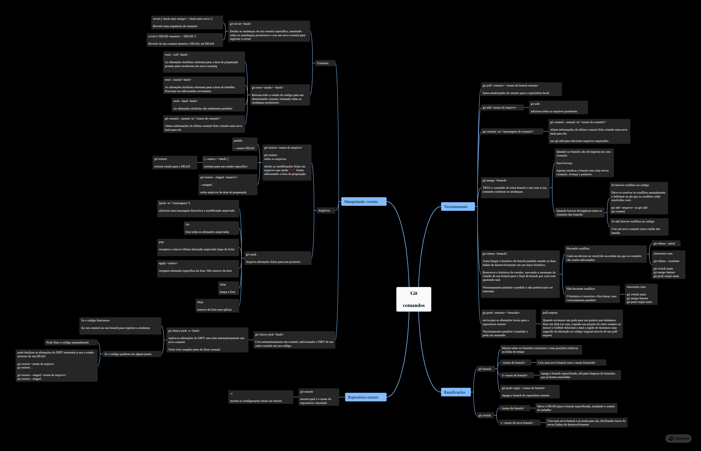
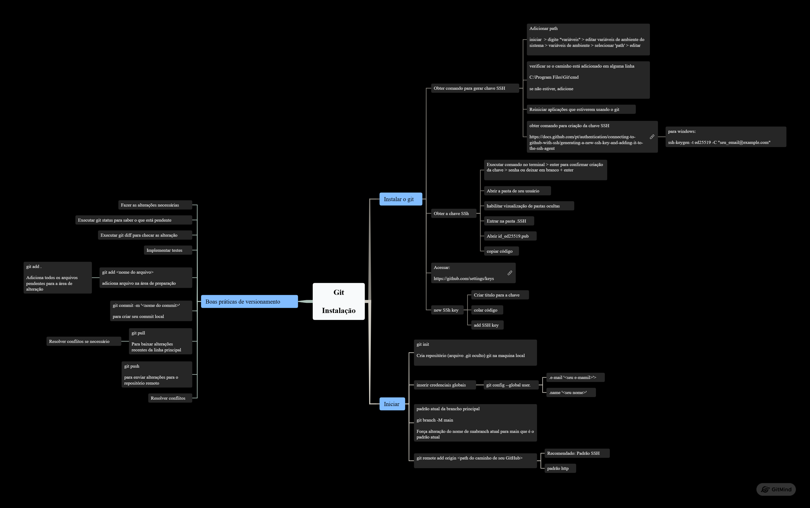
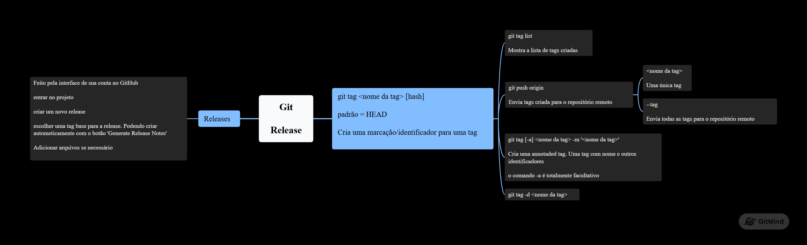
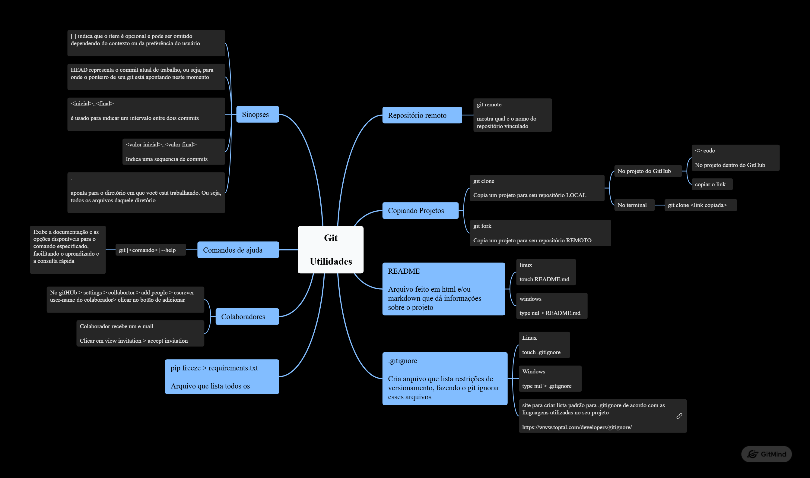
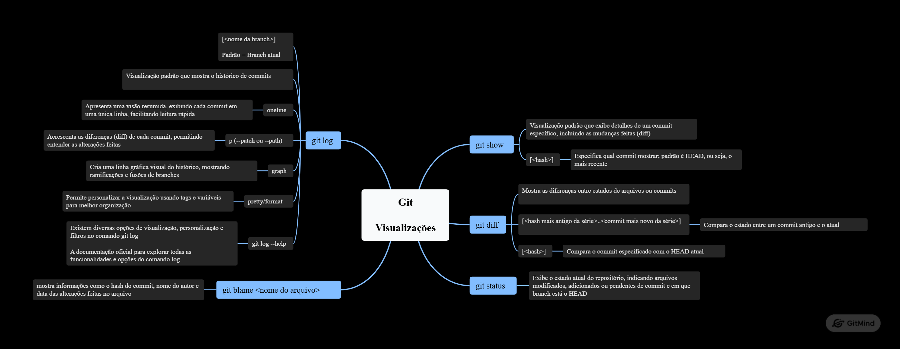

# Mapa Mental de Comandos Git


Este projeto contém **mapas mentais** com os principais **comandos do Git**, pensado para facilitar o aprendizado e a memorização das operações mais usadas.

Contribuições

Correções, sugestões e melhorias são sempre bem-vindas! Sinta-se à vontade para abrir um issue ou enviar um pull request. Estará ajudando no meu aprendizado!

---

## Visualização rápida

Você pode abrir os arquivos `.gmind` diretamente na plataforma [GitMind](https://gitmind.com/) para explorar os mapas mentais de forma interativa.

### Miniaturas dos mapas mentais

**Comandos Git**  
  

**Instalação Git**  
  

**Release Git**  
  

**Utilidades Git**  
  

**Visualização Git**  
  

> **Dica:** Para abrir cada mapa mental interativamente, clique nos arquivos `.gmind` correspondentes ou abra-os diretamente no [GitMind](https://gitmind.com/).

---

## Como usar

1. Clone este repositório:
   ```bash
   git clone https://github.com/Luis-Carlos-Jr/mapa-mental-de-comandos-git.git
